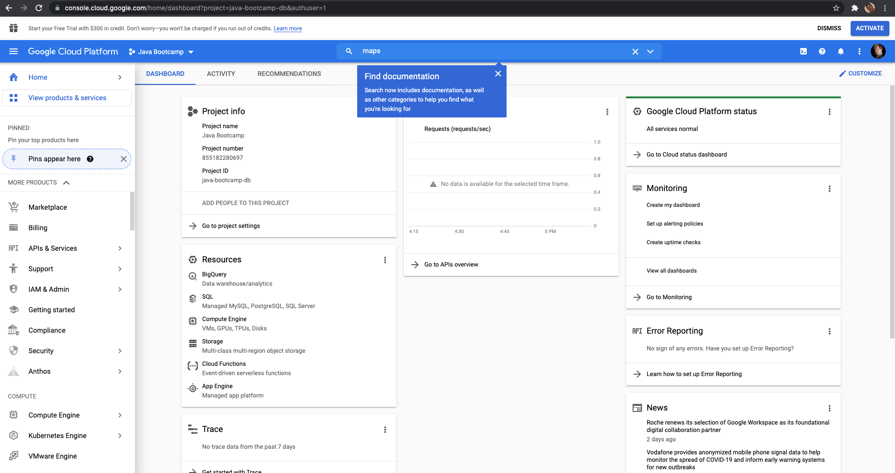
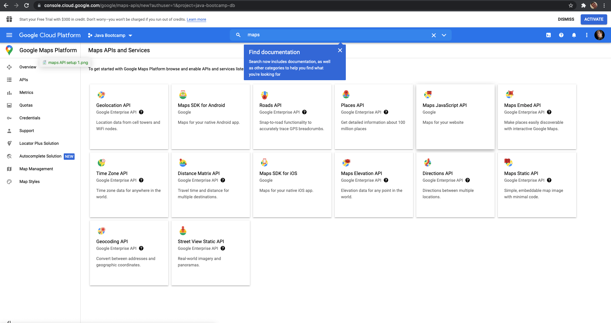
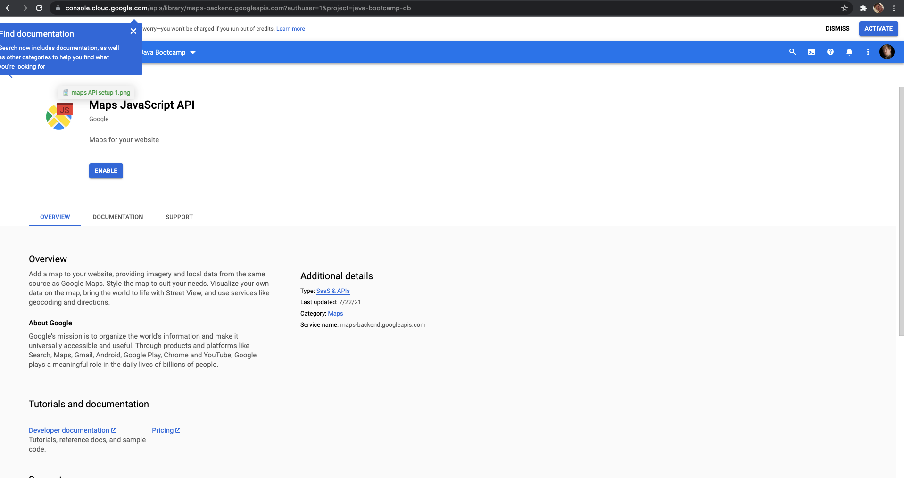
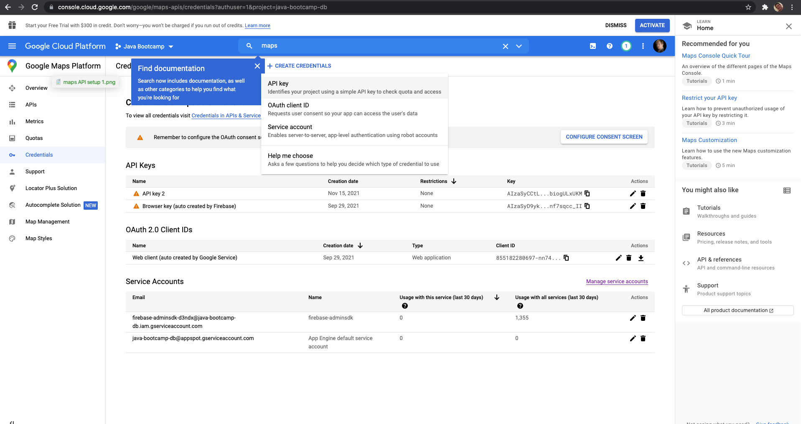

# Application documentation

# How to setup Google Maps integration

## Navigate to Google Cloud Platform; type maps

## Select Maps API and Services; select Maps Javascript API

## Enable the Maps API

## Create API Key
